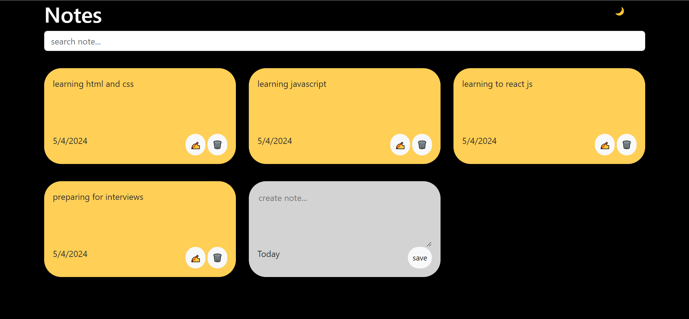

# [🔗](https://notes-making-two.vercel.app/) Notes - notes making application

The Notes Making App is a user-friendly application designed to help users organize and manage their notes efficiently. With its intuitive interface and essential features, users can easily add, delete, and edit the note to stay organized and productive.



## Technologies Used

- Frontend: React.js, HTML5, CSS3, JavaScript
- UI Framework: Bootstrap

## Setup Instructions

- Clone the repository to your local machine using

```bash
git clone https://github.com/Faesalkhan/Notes-making
```

- Navigate to the project directory.
- Install dependencies using

```bash
npm install
```

- Start the frontend development server using

```bash
npm start
```

- Access the website in your browser at localhost.

Feel free to contribute to this project by submitting bug fixes, feature enhancements, or new ideas through pull requests.
